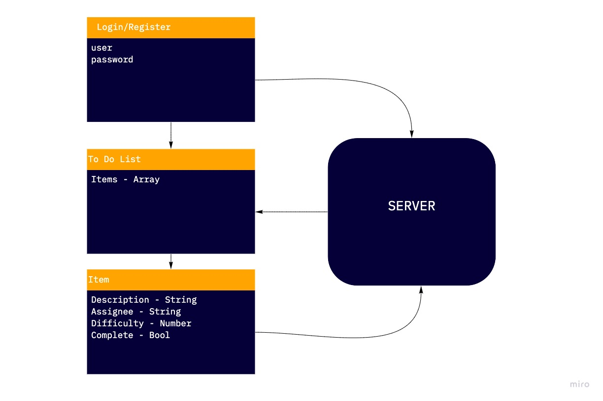

# To Do List Management System

Lab #1 PR: [https://github.com/peterjast/todo/pull/1](https://github.com/peterjast/todo/pull/1)

Lab #2 PR: [https://github.com/peterjast/todo/pull/5](https://github.com/peterjast/todo/pull/5)

Lab #3 PR: [https://github.com/peterjast/todo/pull/6](https://github.com/peterjast/todo/pull/6)

Deployed: [https://ps-todo.netlify.app/](https://ps-todo.netlify.app/)

## Install Dependences

npm i

## Run the applications

npm run start

## Data Flow

